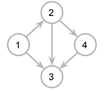

## Descrição

Exemplo de uma preparação para uma partida de futebol no jogo FIFA online, na modalidade Division Rivals no Ultamte Team

1. Configurar escalação do time no Ultimate Team
2. Escolher uniforme
3. Iniciar Partida Online
4. Aguardar adversário online

As etapas acima se encaixam em um grafo da seguinte natureza:



No caso acima, a solução é a seguinte:

1 -> 2 -> 4 -> 3

## Como testar

Para testar o grafo, basta ter o Python 3 instalado e executar o argquivo `grafo.py` no Terminal:

```bash
python grafo.py
```